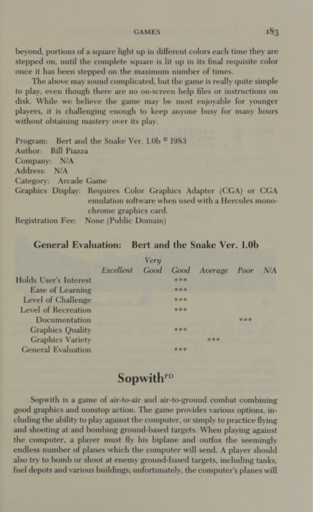
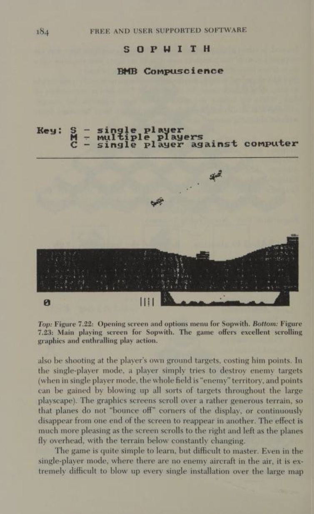
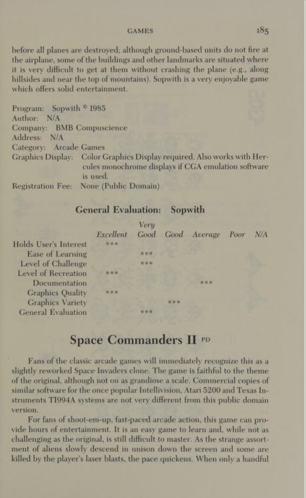

The following is a contemporary review of the original Sopwith from the book
"Free and user supported software for the IBM PC" (1990;
ISBN 9780899504995). The book can be read
[here](https://archive.org/details/freeusersupporte0000lope/page/184/mode/2up)
on the Internet Archive.

