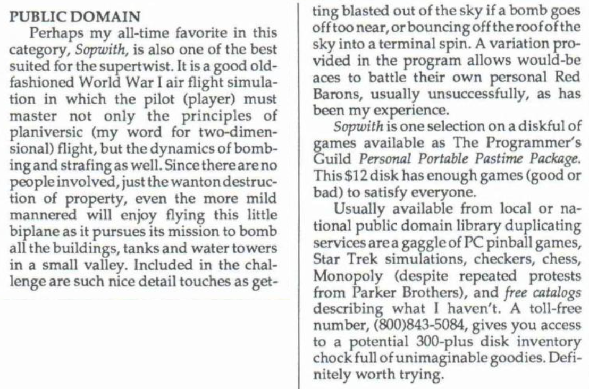

Below is a review of Sopwith by Bob Liddil published in 1989 in
"Portable 100 Magazine".

Bob mentions that Sopwith is available for $12 as part of *The SSB Portable
Passtime Package*, which he had [reviewed the previous year](pico-magazine.md)
in *Pico* Magazine. But wait! A quick search
[reveals](https://gamingafter40.blogspot.com/2011/02/catching-up-with-bob-liddil-aka-captain.html)
that the same Bob Liddil was also the founder of *The Programmer's Guild* which
published the package! An interesting coincidence.
