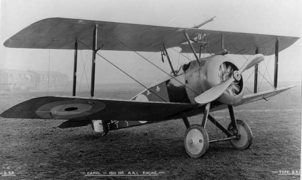

[ **Introduction** | [Imaginet](history2.md) | [DOS versions](history3.md) | [Sopwith meets the Internet](sopwith4.md) ]

# History of Sopwith

At the time of writing, Sopwith is approaching its 40th birthday. Sopwith
is a very old game, and has an interesting history that deserves to be
documented.

First released in 1984, Sopwith was one of the first games for the IBM PC.
Released less than three years after the release of the
[IBM PC](https://en.wikipedia.org/wiki/IBM_Personal_Computer) in August
1981, Sopwith sits within the "first wave" of games developed for the
system. The PC remains an important platform for games to this day.

Sopwith is one of the earliest networked games, and indeed was developed as
a demo program for the proprietary [Imaginet](history2.md) system, an early
form of [LAN](https://en.wikipedia.org/wiki/Local_area_network). Certainly
there are other earlier and contemporary examples, including
[Maze War](https://en.wikipedia.org/wiki/Maze_War) and
[SGI Dogfight](https://en.wikipedia.org/wiki/SGI_Dogfight); Sopwith was not
the first. However, at the time of its release there were still relatively
few other examples. An unfortunate detail is that the game only worked with
the proprietary BMB hardware and drivers, meaning that very few people were
able to use this feature.

Sopwith is one of the oldest video games still in active development today.
In 2018, PC Gamer [published a list](https://www.pcgamer.com/the-80s-and-90s-pc-games-still-unbelievably-being-updated-today/)
of old games still being maintained and developed. Sopwith is not on the list,
but the only game on the list arguably older is
[Hack](https://en.wikipedia.org/wiki/Hack_%28video_game%29) (1984), released
several months earlier and still under development in the form of **NetHack**.
SDL Sopwith is directly derived from the source code to the original DOS
versions, and still includes changelog comments that date all the way back to
1984.

## About BMB Compuscience

BMB Compuscience was a Canadian company founded in 1979 and based in Milton,
Ontario by Bill MacLean, Marcel Brunschweiler and Barbara Brunschweiler. The
initials of their first names were the origin of the name BMB. The business
originally acted as a reseller for Commodore computers, targeting scientists
and researchers. BMB then pivoted to focus on the IBM PC after it was released
in 1981. This proved to be a smart move and BMB racked up enough in sales
that it was able to open six retail stores.

The company went public in 1983 but then experienced difficulties the following
year after a market downturn. BMB responded by discontinuing the retail side
of its business to focus on its own hardware and software products.

Some websites have suggested that BMB went out of business as a result of
litigation but this is not the case. BMB *was* involved in a landmark ruling in
Canadian trademark law named *BMB Compuscience Canada Ltd v Bramalea Ltd.* and
this appears to be the origin of this myth. The company continued into the '90s
before [being acquired by Systems Xcellence Inc.](https://opencorporates.com/companies/ca/1689681)
in 1994 in a [reverse takeover](https://en.wikipedia.org/wiki/Reverse_takeover).
The company later changed its name to SXC Health Solutions, and then [Catamaran
Corporation](https://en.wikipedia.org/wiki/Catamaran_Corporation), before being
acquired by UnitedHealth Group in 2015.

* [National Post article from 1985](articles/natpost_nov_1985.pdf) which
provides some details about BMB.

## The inspiration

The Sopwith Aviation Company was founded by aviation pioneer Thomas Sopwith
in 1913. After World War I broke out, it became one of the main manufacturers
of military planes for the war effort. This included the
[1½ Strutter](https://en.wikipedia.org/wiki/Sopwith_1%C2%BD_Strutter) two
seat general purpose biplane, and the
[Pup](https://en.wikipedia.org/wiki/Sopwith_Pup) and
[Triplane](https://en.wikipedia.org/wiki/Sopwith_Triplane) fighter planes.

Technology advanced quickly over the course of the war and the Pup was quickly
rendered obsolete; the
[Sopwith Camel F.1](https://en.wikipedia.org/wiki/Sopwith_Camel) was an
evolution of the design that was faster, more manoeuvrable and more heavily
armed. It acquired its (unofficial) name as a result of a metal fairing over
the gun breeches that gave the appearance of a hump. While the game does not
clarify *which* Sopwith plane is being flown, it is assumed to be a Camel,
since it is one of the most famous planes of the war; certainly the most
famous produced by the Sopwith Aviation Company.

Camel pilots shot down 1,294 enemy aircraft over the course of the war,
more than any other aircraft. The plane gained a reputation for being agile
but difficult to fly; many novice pilots crashed the plane on takeoff.
5,490 Sopwith Camel aircraft were produced.

In popular culture the Camel is known for being the biplane flown by the
protagonist in the *Biggles* series of novels, and also by Snoopy in the *Peanuts*
comic strip (in his imagined dogfights with "The Red Baron").

---

**Next:** [Imaginet](history2.md)

