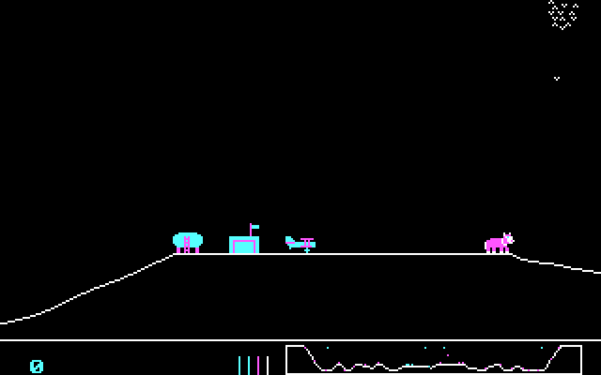
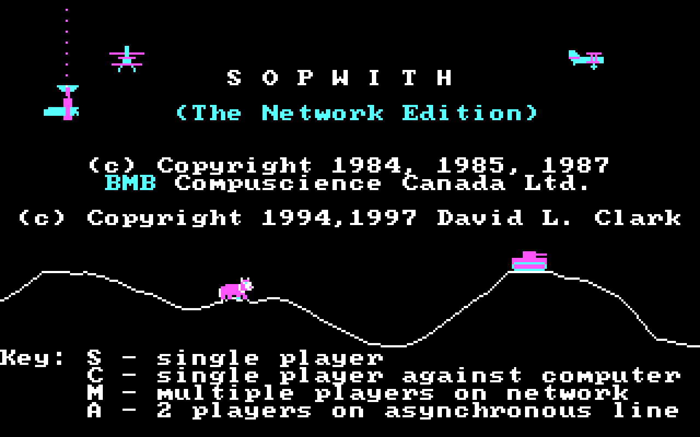
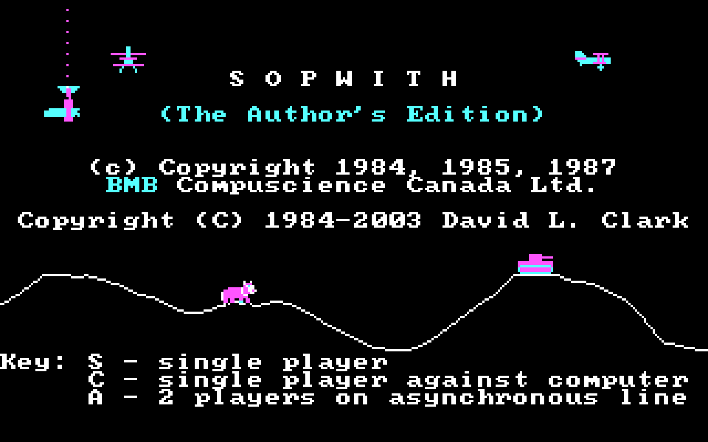

# History of Sopwith

At the time of writing, Sopwith is approaching its 40th birthday. Sopwith
is a very old game, and has an interesting history that deserves to be
documented.

First released in 1984, Sopwith was one of the first games for the IBM PC.
Released less than three years after the release of the
[IBM PC](https://en.wikipedia.org/wiki/IBM_Personal_Computer) in August
1981, Sopwith sits within the "first wave" of games developed for the
system. The PC remains an important platform for games to this day.

Sopwith is one of the earliest networked games, and indeed was developed as
a demo program for the proprietary Imaginet system, an early form of
[LAN](https://en.wikipedia.org/wiki/Local_area_network)  Certainly there
are other earlier and contemporary examples, including
[Maze War](https://en.wikipedia.org/wiki/Maze_War) and
[SGI Dogfight](https://en.wikipedia.org/wiki/SGI_Dogfight); Sopwith was not
the first. However, at the time of its release there were still relatively
few other examples. An unfortunate detail is that the game only worked with
the proprietary BMB hardware and drivers, meaning that very few people were
able to use this feature.

Sopwith is one of the oldest video games still in active development today.
In 2018, PC Gamer [published a list](https://www.pcgamer.com/the-80s-and-90s-pc-games-still-unbelievably-being-updated-today/)
of old games still being maintained and developed. Sopwith is not on the list,
but the only game on the list arguably older is
[Hack](https://en.wikipedia.org/wiki/Hack_%28video_game%29) (1984), released
several months earlier and still under development in the form of **NetHack**.
SDL Sopwith is directly derived from the source code to the original DOS
versions, and still includes changelog comments that date all the way back to
1984.

## About BMB Compuscience

BMB Compuscience was a Canadian company founded in 1979 and based in Milton,
Ontario by Bill MacLean, Marcel Brunschweiler and Barbara Brunschweiler. The
initials of their first names were the origin of the name BMB. The business
originally acted as a reseller for Commodore computers, targeting scientists
and researchers. BMB then pivoted to focus on the IBM PC after it was released
in 1981. This proved to be a smart move and BMB racked up enough in sales
that it was able to open six retail stores.

The company went public in 1983 but then experienced difficulties the following
year after a market downturn. BMB responded by discontinuing the retail side
of its business to focus on its own hardware and software products.

Some websites have suggested that BMB went out of business as a result of
litigation but this is not the case. BMB *was* involved in a landmark ruling in
Canadian trademark law named *BMB Compuscience Canada Ltd v Bramalea Ltd.* and
this appears to be the origin of this myth. The company continued into the '90s
before [being acquired by Systems Xcellence Inc.](https://opencorporates.com/companies/ca/1689681)
in 1994 in a [reverse takeover](https://en.wikipedia.org/wiki/Reverse_takeover).
The company later changed its name to SXC Health Solutions, and then [Catamaran
Corporation](https://en.wikipedia.org/wiki/Catamaran_Corporation), before being
acquired by UnitedHealth Group in 2015.

* [National Post article from 1985](articles/natpost_nov_1985.pdf) which
provides some details about BMB.

## Imaginet

BMB was not a games company; Sopwith was developed as a demo application for
the Imaginet networking system, an early form of
[LAN](https://en.wikipedia.org/wiki/Local_area_network) that networked IBM
PCs and Atari STs. David Clark has described Sopwith as something he hoped
would attract attention at trade shows.
A more serious application for Imaginet was an electronic mail system system
called NetMail, which was later the subject of the lawsuit mentioned above.

The Imaginet system does not appear to have been particuarly successful and
not much information seems to be available on it.  One
[article](imaginet-ad.md) about the system explains that it allowed multiple
computers to share a floppy disk drive to exchange data, with the drives
possibly being entirely virtual. From examination of the source code, Sopwith
itself appears to have worked by having different players continually reading
and writing from the same disk sector.

On the client computers the drive would appear as though it was just another
floppy drive. Marketing materials for Imaginet emphasized this "transparency"
that allowed normal DOS software to interface with the network; this was
probably a very important feature in the years before 1987 when MS-DOS 3.0
introduced native interfaces for networking.

* [Three page ad published in Canadian Datasystems](imaginet-ad.md) that gives
a decent amount of technical information about Imaginet and how it worked.
* [1984 full-page ad from the Edmonton Journal](articles/edmonton_journal_oct1984.pdf)
about BMB and Imaginet.
* [Cover photo from BMB's annual report](https://www.flickr.com/photos/stompr/4302616998)
that shows boxed copies of the Imaginet software, NetMail, and other BMB
software (credit to R Stomphorst for sharing this photo on Flickr).

BMB had previously developed a very similar network system to Imaginet for the
Commodore PET called MUPET which had enjoyed some moderate success. As with
Imaginet it allowed multiple computers to share a floppy drive. Much more is
known about this system which may give some sense of how Imaginet worked:

* [MUPET brochure](articles/mupet-brochure.pdf)
(credit to vintagecomputer.ca).
* [Photo of the MUPET hardware](https://www.flickr.com/photos/stompr/4581759820)
(credit to R Stomphorst for sharing this photo on Flickr).
* [Video demonstration of the MUPET system](https://youtu.be/FvBC-83rk2w) (credit
goes to Harry McCracken who originally shared this on Twitter).

## The inspiration

The Sopwith Aviation Company was founded by aviation pioneer Thomas Sopwith
in 1913. After World War I broke out, it became one of the main manufacturers
of military planes for the war effort. This included the
[1½ Strutter](https://en.wikipedia.org/wiki/Sopwith_1%C2%BD_Strutter) two
seat general purpose biplane, and the
[Pup](https://en.wikipedia.org/wiki/Sopwith_Pup) and
[Triplane](https://en.wikipedia.org/wiki/Sopwith_Triplane) fighter planes.

Technology advanced quickly over the course of the war and the Pup was quickly
rendered obsolete; the
[Sopwith Camel F.1](https://en.wikipedia.org/wiki/Sopwith_Camel) was an
evolution of the design that was faster, more manoeuvrable and more heavily
armed. It acquired its (unofficial) name as a result of a metal fairing over
the gun breeches that gave the appearance of a hump. While the game does not
clarify *which* Sopwith plane is being flown, it is assumed to be a Camel,
since it is one of the most famous planes of the war; certainly the most
famous produced by the Sopwith Aviation Company.

Camel pilots shot down 1,294 enemy aircraft over the course of the war,
more than any other aircraft. The plane gained a reputation for being agile
but difficult to fly; many novice pilots crashed the plane on takeoff.
5,490 Sopwith Camel aircraft were produced. In popular
culture the Camel is known for being the biplane flown by the protagonist in
the *Biggles* series of novels, and by Snoopy in the *Peanuts* comic
strip (in his imagined dogfights with "The Red Baron").

# Original DOS Sopwith versions

There are several MS-DOS versions of Sopwith which contain different features
as the game was expanded and developed.
Please note that other than the Author's Edition, these versions are
**not** open source.

|     | 1   | 1.5 | 2   | Network Edition | Author's Edition |
| --- | --- | --- | --- | --------------- | ---------------- |
| Solid ground                    | ✓ |   |   |   |   |
| 640x200 "hi res" mode           | ✓ |   |   |   |   |
| Speed depends on CPU            | ✓ | ✓ |   |   |   |
| Enemy planes drop bombs         |   | ✓ |   |   |   |
| Oxen and birds                  |   |   | ✓ | ✓ | ✓ |
| Explosions leave debris         |   |   | ✓ | ✓ | ✓ |
| Novice mode                     |   |   |   | ✓ | ✓ |
| Missiles and starbursts         |   |   |   | ✓ | ✓ |
| Wounded planes                  |   |   |   | ✓ | ✓ |
| Window "splats"                 |   |   |   | ✓ | ✓ |
| Imaginet multiplayer            | ✓ | ✓ | ✓ | ✓ |   |
| Async (serial line) multiplayer |   |   | ✓ | ✓ | ✓ |
| Joystick support                |   | ✓ | ✓ | ✓ | ✓ |
| Compiler                        | Computer Innovations C | CIC | CIC | Microsoft C | MSC |

## Sopwith 1

The oldest version, released in 1984, was the original demo for
the Imaginet networking system developed by BMB Compuscience of Canada.
Its main distinguishing feature is the use of solid white ground, which
was later replaced by a single line (to improve performance). To
avoid having to redraw the screen, the "camera" only moves sometimes.

Speed is CPU-dependent, so the game runs too fast on machines faster
than the original IBM XT unless a utility like MOSLO is used (or the
number of cycles adjusted to a low number on emulators like DOSbox.
Uniquely to this version, an undocumented `-h` command line argument will
run the game in the CGA 640x200 "hi res" mono mode rather than the usual
640x200 color mode.

The musical theme to this version is
[Merrily We Roll Along](https://en.wikipedia.org/wiki/Merrily_We_Roll_Along_%28song%29)
better known as the theme song for the Warner Brothers ***Merry Melodies***
cartoon. However, the music doesn't play on the title screen unless Sopwith
is run with the `-s` command line parameter.

Multiplayer depends on the proprietary BMB drivers and Imaginet networking
system and to my knowledge, no fans have ever been able to get it working.

A review was published of this version in the book "Free and user supported
software for the IBM PC"; you can read it [here](free-ibmpc.md).

* [Download (.zip)](original-files/sopwith1.zip) (includes original
  documentation)
* [Documentation](original-files/sopwith1_docs.txt) for this version.
* [Play emulated version](https://archive.org/details/msdos_Sopwith_1985) on
  archive.org.

  

## Sopwith 1.5

I recently came across this version, which I'm calling Sopwith 1.5 since
its development clearly sits between the better known Sopwith 1 and 2. In
my opinion this is perhaps best described as a beta version of the later
Sopwith 2 - it is unique in that computer planes drop bombs, a feature
that never appeared in any other version and does not appear to work
very well.

Solid ground has been replaced by a line at this point in development,
and joystick support added.
However, later changes are not yet present, like oxen and birds,
or explosions leaving debris. It still runs at the speed of the CPU,
like Sopwith 1, so the same slowdown techniques are needed to make it
playable.

By this version the theme music has been changed to [The U.S. Air Force](https://en.wikipedia.org/wiki/The_U.S._Air_Force_%28song%29)
(aka ***Wild Blue Yonder***), the official song of the US Air Force.
This music is used in Sopwith 2 and all future versions.

* [Download (.zip)](original-files/sop15.zip)

 

## Sopwith 2

Perhaps the best-known of the DOS versions, this was a significant step
forward over the original. Note that the name "Sopwith 2" is a fan
invention to distinguish it from the older version, and the game does
not describe it with that name.

In terms of gameplay the most immediately noticeable feature is the
addition of oxen and birds to the game. More subtle changes include tweaks
to how explosions work - debris is longer-lived and provides more of a
hazard to the player. Speed is now CPU independent, the game supports
IBM compatible joysticks, and serial line networking, although this
latter feature is still unusable because it also requires a proprietary
BMB driver.

* [Download (.zip)](original-files/sopwith2.zip)
* [Documentation](https://github.com/fragglet/sdl-sopwith/blob/trunk/doc/origdoc.txt)
  for this version.
* [Play emulated version](https://archive.org/details/msdos_Sopwith_2_1985) on
  archive.org.

  

## Network Edition

Released by the author David L. Clark in the late '90s, the main features
are the addition of novice mode and wounded planes. Novice mode in
particular is convenient since it makes it impossible to stall the
plane, a common stumbling block for new players.

A controversial feature added in this release is guided missiles and
starbursts (chaff/flares) which are presumably intended to make multiplayer
more fun (they have to be enabled with the `-x` command line parameter).
The missiles are dumb missiles when fired by the player but heat-seeking
when fired by computer planes, making the single player experience almost
impossible.

Some more subtle changes: oil tank explosions were made much smaller,
bird strikes no longer result in an explosion, and computer planes avoid
crashing into oxen.

A cute addition is that of window "splats": bird strikes result in a
splatted bird appearing on the screen, and getting hit by a bullet results
in similar broken glass cracks. Perhaps the funniest of all occurs after
flying through an ox: the entire screen turns pink from blood.

Drivers are available that can be used to play this version and the Author's
Edition over a serial line; see the download link below. These were
originally posted by the user "per" on [a thread on the VCFEd](https://forum.vcfed.org/index.php?threads/dos-game-red-baron.14382/)
forums. These drivers apparently (?) do not work with Sopwith 2. A driver
file is also included for the original BMB network hardware, but you are
unlikely to be able to get this to work unless you have original BMB
hardware. Under DOSbox you will need the
[DRVLOAD](http://cd.textfiles.com/pier/pier04/010/v12n19.zip) program
to be able to load the drivers.

* [Download (.zip)](original-files/swnet.zip)
* [Download drivers (.zip)](original-files/SopwithDrivers.zip)

  

## Author's Edition

Largely identical to the Network Edition, but the original BMB networking
has been removed. This was the basis for the source code release by David
Clark.

The code was originally released in 2000 under a non-commercial license, but
was later re-released under the GPL in 2003. There are some
[very minor differences](original-files/sopwith-orig-gpl.diff) between
the two source releases. A GPL blurb was added to the program help text (as
the GPL itself recommends doing), and the copyright year on the title screen
was updated. The earlier release described itself as "Distribution Version"
rather than "The Author's Version", presumably because Clark doesn't want
other people calling their versions by that name.

* [Download (.zip)](original-files/swauth.zip)
* [Download source code (original non-free license, .zip)](original-files/origsrc.zip)
* [Download source code (GPL re-release, .zip)](original-files/gplsrc.zip)
* [Play emulated version](https://archive.org/details/msdos_Sopwith_-_The_Authors_Edition_2000) on
  archive.org.

