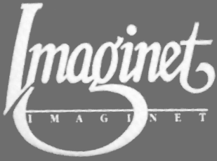

[ [Introduction](history.md) | **Imaginet** | [DOS versions](history3.md) ]

## Imaginet

BMB was not a games company; Sopwith was developed as a demo application for
the Imaginet networking system, an early form of
[LAN](https://en.wikipedia.org/wiki/Local_area_network) that networked IBM
PCs and Atari STs. David Clark has described Sopwith as something he hoped
would attract attention at trade shows.

### MUPET

BMB's previous focus had been the Commodore PET, where it had developed a
system named MUPET that had enjoyed some moderate success. MUPET allowed
multiple computers to share a floppy drive. The following articles (and video
demonstration) give some details of how it worked:

* [MUPET brochure](articles/mupet-brochure.pdf)
(credit to vintagecomputer.ca).
* [Photo of the MUPET hardware](https://www.flickr.com/photos/stompr/4581759820)
(credit to R Stomphorst for sharing this photo on Flickr).
* [Video demonstration of the MUPET system](https://youtu.be/FvBC-83rk2w) (credit
goes to Harry McCracken who originally shared this on Twitter).

### The pivot to PCs

After the release of the IBM PC in 1981, BMB changed its focus to the new
platform and it became a successful reseller of PCs through its chain of
Canadian stores named *The Information Connection*.
Meanwhile, it set about producing a similar system to MUPET that it called
*Imaginet*. As with MUPET, it allowed multiple PCs to share a floppy disk. By
1984 the first version of Imaginet had been made available, and the first
versions of Sopwith date to this time.

Some [articles](imaginet.md) describe the system, including a multi-page ad
written by Jack Cole, one of the system's technical architects, who gives some
details about the system and the underlying philosophy behind its design.
A virtual drive could be accesed by multiple other client machines, and the
shared drive would appear to those clients as though it was just another floppy
drive.

Marketing materials for Imaginet emphasized this "transparency" that allowed
normal DOS software to interface with the network.  This was the origin of the
Imaginet name, the idea being that "you have to imagine that a network's really
there".  The system could work hierarchically, with the idea that the network
could mirror a company's corporate structure.

By far the most detailed technical description of the system can be found in
[Canadian patent 1172380](articles/canada-patent-1172380.pdf) that BMB obtained
on the system. The Imaginet card replaced the usual floppy disk controller
card, forwarding all floppy disk access instead to the host computer. The
"disk" itself on the host could be a physical disk drive but more often would
be a floppy disk image stored on the host computer's hard disk. The system also
allowed printers to be shared.

Imaginet's hardware-based networking seems unusual nowadays, where networking
is based on protocols and, of course, connection to the Internet. Nonetheless,
the system provided some unique advantages - specifically software
compatibility - that was likely unmatched by competing products. MS-DOS at the
time did not have any native interfaces for networking, and would not gain
them until 1987 with the release of MS-DOS 3.0. The hardware-based approach
also meant that any operating system could be used - IBM originally offered
multiple options including CP/M-86.

* [Some published articles about Imaginet](imaginet.md) that give some
technical information about the system and how it worked.
* [Canadian patent 1172380](articles/canada-patent-1172380.pdf) and the
equivalent [US patent 4792896](us-patent-4792896.pdf).
* [1984 full-page ad from the Edmonton Journal](articles/edmonton_journal_oct1984.pdf)
about BMB and Imaginet.
* [Cover photo from BMB's annual report](https://www.flickr.com/photos/stompr/4302616998)
that shows boxed copies of the Imaginet software, NetMail, and other BMB
software (credit to R Stomphorst for sharing this photo on Flickr).

### Sopwith: the trade show demo

Sopwith was developed as a demo application for the Imaginet system that
supported up to four players at a time. From examination of the source code,
communication appears to have worked by having different players continually
reading and writing from the same disk sector.

Sopwith somehow "escaped the lab" and PC players everywhere came to enjoy
its single player modes. No doubt many fans curious about the multiplayer option
on the main menu have tried over the years to make it work, but without the
Imaginet hardware, their efforts were futile. The reliance on direct hardware
access made its use with other networking systems impossible, since few (if
any) supported such a feature. It is only recently, with the
[Imaginot](https://github.com/fragglet/imaginot) adapter program, that the
original multiplayer has been successfully made to work again.

Besides Sopwith, a serious application for Imaginet was an electronic mail
system system called NetMail, notable for having been the subject of a
landmark Canadian court ruling over a claim that its name was infringing on
another company's trademark (BMB won the case). While Imaginet does not appear
to have been particuarly successful in the marketplace, it did find some
customers in Canada, and remains an interesting footnote in the history of PC
networking.

---

**Next:** [DOS versions](history3.md)

