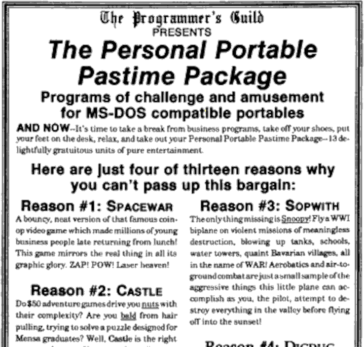
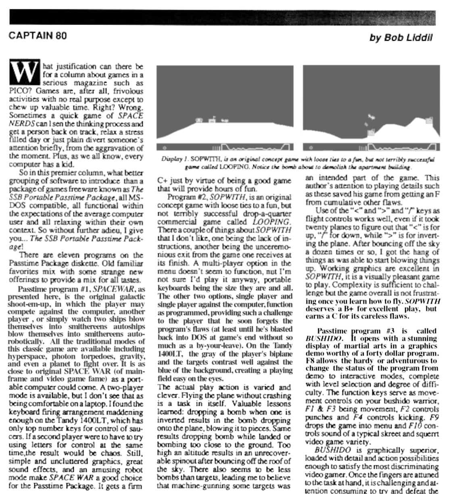

# History of Sopwith part 3: Sopwith escapes the lab

[ [Introduction](history.md) \|
[Imaginet](history2.md) \|
**Sopwith escapes** \|
[DOS versions](history4.md) \|
[On the Internet](history5.md) ]

Intended as a trade-show demo, it's unclear how Sopwith escaped to the general
public. David L. Clark didn't even discover [until around
2000](https://youtu.be/4d0iCQmroMQ?t=1114) that it had "gotten out". Little
did he know, Sopwith had been circulating for years in collections of early
games for the IBM PC. Only a couple of years after the first version was
released, ads were appearing in magazines like PC Magazine advertising Sopwith
for sale as part of collections of games for the IBM PC:

 \
Ad from [PC Magazine's August 1986
edition](https://archive.org/details/PC-Mag-1986-08-01/page/n89/mode/2up?q=sopwith)

They weren't the only one. Moorshead Publications [boasted in
1988](https://archive.org/details/ElectronicsTechnologyToday1988198919901991/ElectronicsTechnologyToday1988-09/page/n30/mode/1up?q=Sopwith)
of Sopwith's "superb graphics" - high praise for a four-color CGA game when PC
gamers were now enjoying 16-color EGA graphics!

*The Programmer's Guild* included Sopwith in their "Portable Pastime Package",
the ad for which claimed for some reason that Sopwith's gameplay involved
"blowing up schools" in "quaint Bavarian villages":

Needless to say, BMB were not getting any money out of these sales and most of
these distributors were passing off Sopwith as "public domain software".
Keypunch Software took things a step further by hacking the game to rename it
"Red Baron" and selling along with several other aviation-themed games as part
of its "[Strike
Force](https://www.computinghistory.org.uk/det/63910/Strike-Force/)"
collection. The BMB name was stripped from the title screen and replaced by
the words "PUBLIC DOMAIN".

## Reviews

Because it had never had any official release as a commercial game, there
weren't a lot of contemporary reviews of Sopwith. Nevertheless it did get a
bit of attention.
Perhaps most notably of all was [Sopwith's appearance](articles/free-ibmpc.md)
in the 1990 book "Free and user supported software for the IBM PC" where it was
described as a "very enjoyable game which offers solid entertainment" and
received an overall evaluation of "excellent":

In 1988 Bob Liddil reviewed Sopwith in *Pico Magazine* as part of an article on
the previously-mentioned *Personal Pastime Package*:

 \
Article by Bob Liddil discussing Sopwith (partially reconstructed)

In fact, Bob loved Sopwith's gameplay so much that he
[wrote about it again](articles/portable-100-magazine.md) in his column for
Portable 100 magazine the following year:

But wait! A quick search
[reveals](https://gamingafter40.blogspot.com/2011/02/catching-up-with-bob-liddil-aka-captain.html)
that Bob was himself the founder of The Programmer's Guild. What a coincidence!

**Next:** [Original DOS versions](history4.md)
