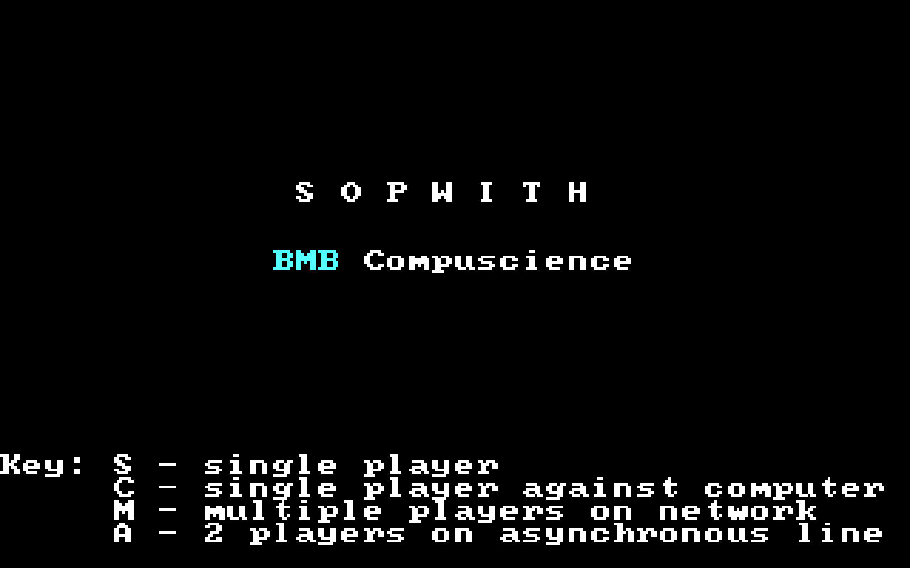
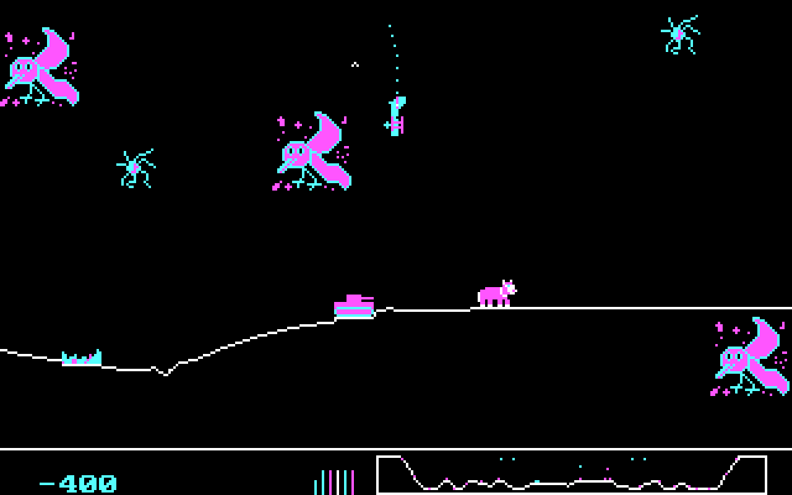

[ [Introduction](history.md) | [Imaginet](history2.md) | **DOS versions** | [On the Internet](history4.md) ]

# Original DOS Sopwith versions

Sopwith was (originally) an MS-DOS game and several different versions
are known to exist. These different versions contain different features
as the game was expanded and developed. This page documents these
different versions.

Fans have developed their own names for these different versions,
specifically those known as "Sopwith 1" and "Sopwith 2". However, these
names are not official, and do not appear anywhere in the program. So
they are not true "sequels", only different versions of the same game.

## Features

The following table gives a quick rundown of the various features of the
different versions:

|     | 1   | 1.5 | 2   | Network Edition | Author's Edition |
| --- | --- | --- | --- | --------------- | ---------------- |
| Solid ground                    | ✓ |   |   |   |   |
| Speed depends on CPU            | ✓ | ✓ |   |   |   |
| Enemy planes drop bombs         |   | ✓ |   |   |   |
| Oxen and birds                  |   |   | ✓ | ✓ | ✓ |
| Explosions leave debris         |   |   | ✓ | ✓ | ✓ |
| Novice mode                     |   |   |   | ✓ | ✓ |
| Missiles and starbursts         |   |   |   | ✓ | ✓ |
| Wounded planes                  |   |   |   | ✓ | ✓ |
| Window "splats"                 |   |   |   | ✓ | ✓ |
| Imaginet multiplayer            | ✓ | ✓ | ✓ | ✓ |   |
| 640x200 "hi res" mode           | ✓ (`-h`) | ✓ | ✓ | ✓ |   |
| Async (serial line) multiplayer |   |   | ✓ | ✓ | ✓ |
| Joystick support                |   | ✓ | ✓ | ✓ | ✓ |
| Compiler                        | Computer Innovations C | CIC | CIC | Microsoft C | MSC |

## Sopwith 1

The oldest version, released in 1984, was the original demo for the
Imaginet networking system.  Its main distinguishing feature is the use
of solid white ground, which was later replaced by a single line (to
improve performance). To avoid having to redraw the screen, the "camera"
only moves sometimes.

Speed is CPU-dependent, so the game runs too fast on machines faster
than the original IBM XT unless a utility like MOSLO is used (or the
number of cycles adjusted to a low number on emulators like DOSbox.
As with later versions, this version supports running the game in 640x200
CGA "hi res" mono mode, but the command line argument to enable it is `-h`;
this was changed to `-w` in later versions.

The musical theme to this version is
[Merrily We Roll Along](https://en.wikipedia.org/wiki/Merrily_We_Roll_Along_%28song%29)
better known as the theme song for the Warner Brothers ***Merry Melodies***
cartoon. However, the music doesn't play on the title screen unless Sopwith
is run with the `-s` command line parameter. Interestingly, David Clark
[does not remember](https://youtu.be/bIoYM_p3HX4?t=1710) the game ever having
this music.

The multiplayer feature was thought to be unusable without the original
Imaginet hardware, but has recently
[been made to work](https://www.youtube.com/watch?v=HxEBEqbuIqI) by
having multiple instances of QEMU sharing a floppy disk image.

A review was published of this version in the book "Free and user supported
software for the IBM PC"; you can read it [here](free-ibmpc.md).

* [Download (.zip)](original-files/sopwith1.zip)
* [Documentation](original-files/sopwith1_docs.txt) for this version.
* [Play emulated version](https://archive.org/details/msdos_Sopwith_1985) on
  archive.org.

  

## Sopwith 1.5

I recently came across this version, which I'm calling Sopwith 1.5 since
its development clearly sits between the better-known Sopwith 1 and 2. In
my opinion this is perhaps best described as a beta version of the later
Sopwith 2 - it is unique in that computer planes drop bombs, a feature
that never appeared in any other version and does not appear to work
very well.

Solid ground has been replaced by a line at this point in development,
and joystick support added.
However, later changes are not yet present, like oxen and birds,
or explosions leaving debris. It still runs at the speed of the CPU,
like Sopwith 1, so the same slowdown techniques are needed to make it
playable.

By this version the theme music has been changed to
[The U.S. Air Force](https://en.wikipedia.org/wiki/The_U.S._Air_Force_%28song%29)
(aka ***Wild Blue Yonder***), the official song of the US Air Force.
This music is used in Sopwith 2 and all future versions.

* [Download (.zip)](original-files/sop15.zip)

 

## Sopwith 2

Perhaps the best-known of the DOS versions, this was a significant step
forward over the original. Note that the name "Sopwith 2" is a fan
invention to distinguish it from the older version, and the game does
not describe it with that name.

In terms of gameplay the most immediately noticeable feature is the
addition of oxen and birds to the game. More subtle changes include tweaks
to how explosions work - debris is longer-lived and provides more of a
hazard to the player. Speed is now CPU independent, the game supports
IBM compatible joysticks, and serial line networking, although this
latter feature is still unusable because it also requires a proprietary
BMB driver.

The multiplayer feature has recently been made usable through the
[Imaginot](https://github.com/fragglet/imaginot) adapter program.

* [Download (.zip)](original-files/sopwith2.zip)
* [Documentation](original-files/sopwith2_docs.txt) for this version.
* [Play emulated version](https://archive.org/details/msdos_Sopwith_2_1985) on
  archive.org.

   

## The Network Edition

Released by the author David L. Clark in the late '90s, the main features
are the addition of novice mode and wounded planes. Novice mode in
particular is convenient since it makes it impossible to stall the
plane, a common stumbling block for new players.

A controversial feature added in this release is guided missiles and
starbursts (chaff/flares) which are presumably intended to make multiplayer
more fun (they have to be enabled with the `-x` command line parameter).
The missiles are dumb missiles when fired by the player but heat-seeking
when fired by computer planes, making the single player experience almost
impossible.

Some more subtle changes: oil tank explosions were made much smaller,
bird strikes no longer result in an explosion, and computer planes avoid
crashing into oxen.

A cute addition is that of window "splats": bird strikes result in a
splatted bird appearing on the screen, and getting hit by a bullet results
in similar broken glass cracks. Perhaps the funniest of all occurs after
flying through an ox: the entire screen turns pink from blood.

Drivers are available that can be used to play this version and the Author's
Edition over a serial line; see the download link below. These were
originally posted by the user "per" on [a thread on the VCFEd](https://forum.vcfed.org/index.php?threads/dos-game-red-baron.14382/)
forums. These drivers apparently (?) do not work with Sopwith 2. A driver
file is also included for the original BMB network hardware, but you are
unlikely to be able to get this to work unless you have original BMB
hardware. Under DOSbox you will need the
[DRVLOAD](http://cd.textfiles.com/pier/pier04/010/v12n19.zip) program
to be able to load the drivers.

* [Download (.zip)](original-files/swnet.zip)
* [Download drivers (.zip)](original-files/SopwithDrivers.zip)

  

## The Author's Edition

Largely identical to the Network Edition, but the original BMB networking
has been removed. This was the basis for the source code release by David
Clark.

The code was originally released in 2000 under a non-commercial license, but
was later re-released under the GPL in 2003. There are some
[very minor differences](original-files/sopwith-orig-gpl.diff) between
the two source releases. A GPL blurb was added to the program help text (as
the GPL itself recommends doing), and the copyright year on the title screen
was updated. The earlier release described itself as "Distribution Version"
rather than "The Author's Version"; David has specifically requested that
people do not use that name for their versions.

The Author's Edition is the only version that is **truly**
[free](https://www.gnu.org/philosophy/free-sw.en.html) and
[open source](https://opensource.org/osd/) software.

* [Download (.zip)](original-files/swauth.zip)
* [Download source code (original non-free license, .zip)](original-files/origsrc.zip)
* [Download source code (GPL re-release, .zip)](original-files/gplsrc.zip)
* [Play emulated version](https://archive.org/details/msdos_Sopwith_-_The_Authors_Edition_2000) on
  archive.org.

**Next:** [On the Internet](history4.md)
