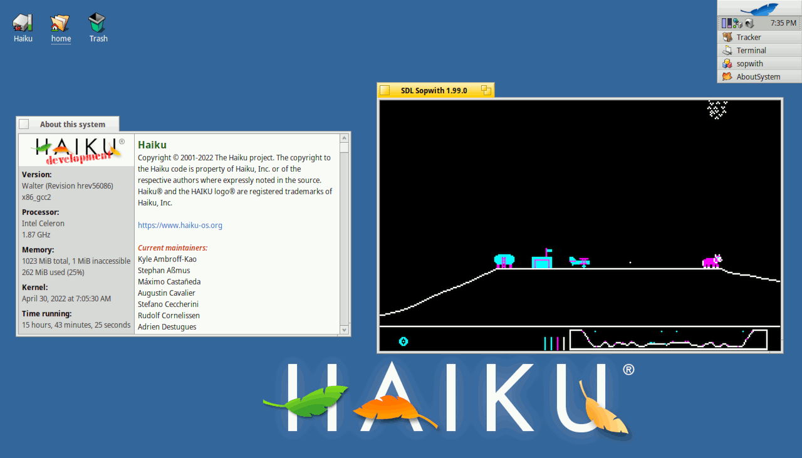
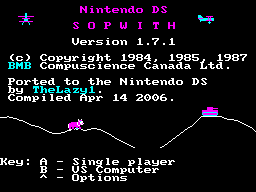
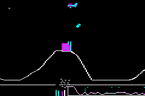
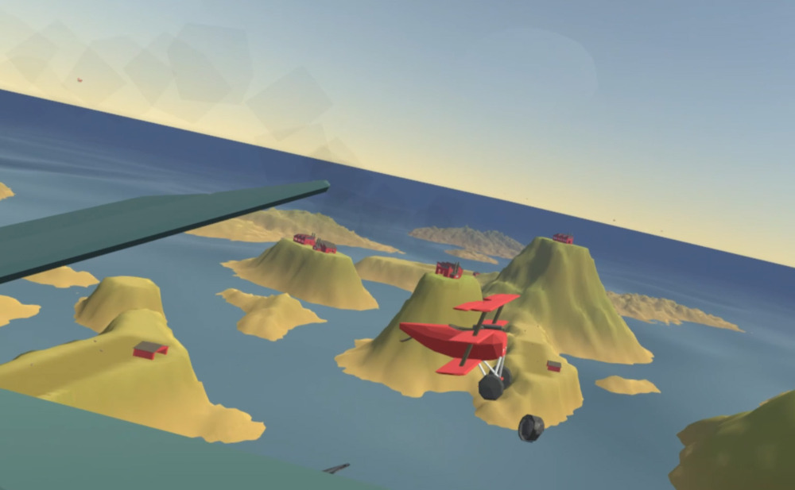
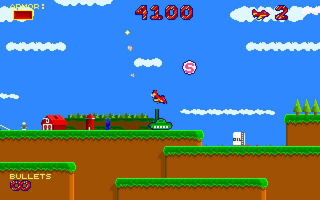

[ [Introduction](history.md) | [Imaginet](history2.md) | [DOS versions](history3.md) | **On the Internet** ]

# Sopwith meets the Internet

With the advent of the Internet, people inevitably started talking about
Sopwith. Newsgroup [alt.games.sopwith](https://groups.google.com/g/alt.games.sopwith)
began in 1995 and provided a convenient place for discussion for the next
five years until newsgroups fell out of use. For a time, there was also a
forum hosted on eGroups (later Yahoo! Groups), the content of which have
sadly now been lost.

Fan site [sopwith.org](http://www.sopwith.org/) appeared around 2000,
providing by far the most detailed information about the game that was
known at the time. The site shared the various different versions along with
mods and tools such as unofficial level editors. The site is still online to
this day, although it has been mostly dormant in recent years.

More recently a [Discord server](https://discord.gg/S2P5wUUzNU) has been set
up for fans to talk about the game and arrange multiplayer games.

## The source code release

In 2000, Sopwith fan Andrew Jenner made contact with David L. Clark, after
discovering his website identifying himself as the original author of the game.
Andrew had already been performing his own reverse engineering project,
decompiling the original Sopwith binaries to C source code. He was subsequently
able to convince David to release the source code to the game.

David's release was of the source code to *The Author's Edition*, which
contained the enhancements to the game that had been added in *The Network
Edition*; the name on the title screen was changed to "Distribution Version",
since David reserves that name for any personal releases of the game.
It also included Andrew's reverse engineered versions of Sopwith 1 and 2.
This first release was under a
non-[free](https://www.gnu.org/philosophy/free-sw.en.html) license, but a
second release of the source code was made in 2003 under the GNU GPL (there
are only very minor differences between the two releases).

This source code release was followed by [Sopwith
3](https://sopwith3.sourceforge.net/), a sequel/remake by Andrew Jenner and
Jornand de Buisonje based on the original source code that is described as
"semi-official".

## Ports

The first release of SDL Sopwith was made in October 2001, adapting the
Sopwith source code to use the [LibSDL](https://libsdl.org/) cross-platform
library. A package was added to [Debian](https://www.debian.org/) in 2003
and the port has since made its way into many other Linux distros along with
the FreeBSD ports collection. Use of the LibSDL library makes the project
highly portable, even to niche OSes like [Haiku](https://www.haiku-os.org/):

SDL Sopwith continues to be developed to this day; recent versions have
added various new features, including custom level support, medals, and
an Emscripten (in-browser) version.

SDL Sopwith has also served as the basis for a number of ports to different
platforms (a list can be found on the [links page](links.md)).

 \
[Homebrew Nintendo DS port](https://www.gamebrew.org/wiki/Sopwith) by
TheLazy1.

 \
[Game Boy Advance port](http://davr.org/sopwith/) by David Rorex.

## Remakes and Cultural Impact

Sopwith has inspired many other games, although exactly how many is unclear,
since the concept of a sidescrolling airplane shoot-'em up has no doubt been
independently invented by others. The following are a few examples, though
there is a more comprehensive list on the [links](links.md) page.

 \
[Sopwith VR (2018)](https://store.steampowered.com/app/998660/Sopwith_VR/), a
VR game that explicitly lists the original Sopwith as an inspiration.

 \
[Goplanes](https://archive.kontek.net/sopwith.classicgaming.gamespy.com/goplanes.htm),
another game that lists Sopwith as an influence.

 \
[Turd-eating cat](https://www.youtube.com/watch?v=1rZFk9ww29U), a surreal
flash animation from 2010. Sometimes Sopwith references pop up in unusual
places.

