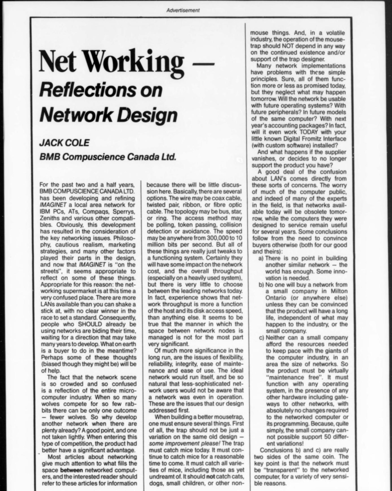
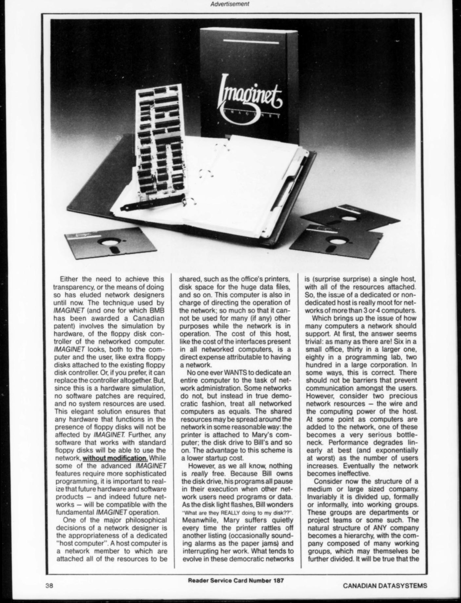
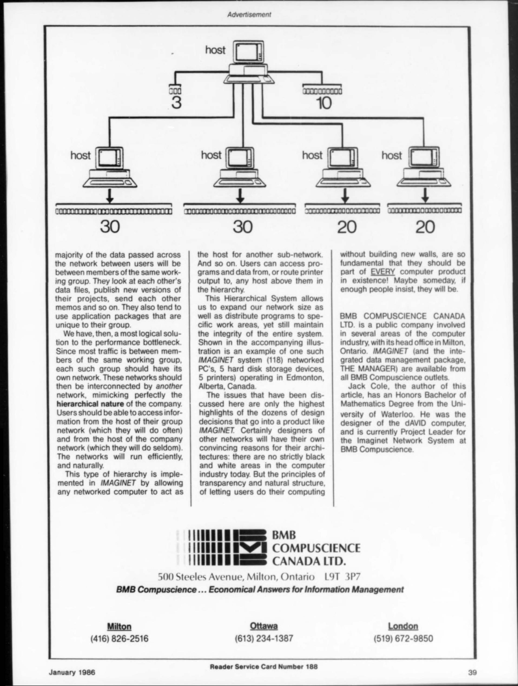
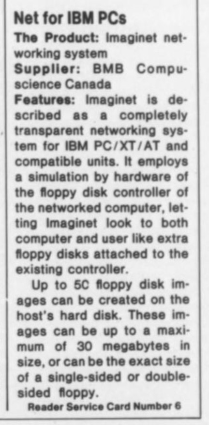

The following three page ad (taking the form of an article about the Imaginet system)
appeared in [Canadian Datasystems](https://archive.org/details/sim_it-magazine_1986-01_18_1/page/n44/mode/1up),
January 1986. More than any other source it gives a lot of detail about how the Imaginet
system worked and the principles behind its design.

A brief review from the same magazine in the [August 1985](https://archive.org/details/sim_it-magazine_1985-08_17_8/page/n5/mode/2up)
edition, describing how "up to 50 floppy disk images can be created on the
host's hard drive":

