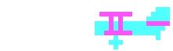

Sopwith is approaching its 40th birthday on April 24th 2024.
[Join us in celebrating!](40years.html)

SDL Sopwith is a port of the classic biplane shoot 'em-up "Sopwith" to run on modern
computers and operating systems. It is named "SDL Sopwith" as it uses the
[LibSDL](https://www.libsdl.org/) cross-platform library.

* [Screenshots](sshot.md) of it in action.
* [Play now](web/sopwith.html) in your browser, or [download it](getit.md).
* [History of the Game](history.md).
* [Github Page](https://github.com/fragglet/sdl-sopwith) where you can browse
  the source code, file bugs and contribute to development of the project.
* If you're a fan of Sopwith, you can
  [join our Discord server!](https://discord.gg/S2P5wUUzNU)

SDL Sopwith is based on the original Sopwith source code, which was released by
its author David L. Clark as Free and Open Source Software under the GNU General
Public License.

