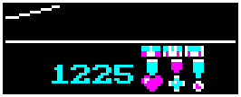

## May 16, 2023

SDL Sopwith v2.2.0 has just been released; here are some of the
highlights:

* Multiplayer support was added for the Windows version, at long last.
* Help text is now shown for new players. This is shown on game start in
  novice mode, but won't be shown again after a successful flight. The help
  text will also appear in other single player modes, but only if it looks
  like you're really struggling to get the plane off the ground.
* It's no longer possible to flip the plane upside down while sitting
  motionless on the runway (a bug since the original DOS versions).
* It's no longer possible to get wounded on the ground. If a plane shoots
  another on the ground, that's a successful raid. This fixes a bug where
  a wounded plane on the runway would still be damaged after takeoff.

A more complete list can be found
[in the release notes](https://github.com/fragglet/sdl-sopwith/releases/tag/sdl-sopwith-2.2.0).

## July 18, 2022

A new release of SDL Sopwith, v2.0.0 is now out after many years of
inactivity within the project. This new release is a new major revision
of SDL Sopwith and includes a large number of changes and improvements,
some of which have been waiting in development for a long time. Here's a
selection of some of the changes:

* The code has been ported to SDL2. This brings  a number of
  improvements but one nice one is that the game can scale to arbitrary
  window sizes and screen resolutions.
* Sound has been reenabled. Sound output is now passed through a bandpass
  filter intended to make it sound like a real PC speaker, and also plays
  back at a much quieter volume, to be less startling to new players.
* Medals are now awarded to reward players; thanks go to Christoph
  Reichenbach for implementing this feature. The image to the right
  shows the selection of medals and ribbons that players can attain. The
  feature can of course be disabled.
* Documentation has been significantly improved - the Unix manpage for
  sopwith has been greatly expanded, and there is a separate manpage for
  the configuration file.
* There is now a configuration screen for setting key bindings, which are
  stored in the same configuration file as other settings.
* The game has been ported to macOS, and a macOS .dmg package is
  available on the download page.
* Network performance has been improved significantly.

## Move from Sourceforge to Github

The project recently moved from Sourceforge to Github and if you have
visited in the past you may notice that this site has been visually
refreshed. Among other things you'll find:

* A fresh new [download page](getit.md) with downloads for both Windows
  and macOS packages.
* A new set of [screenshots](sshot.md) to replace the old ones,
  demonstrating a variety of different operating systems that SDL
  Sopwith has been ported to.
* The [links](links.md) page has a comprehensive set of links to other
  Sopwith-related things that you'll want to check out if you want to
  learn more.

If you're interested in contributing to the project, check out
[the Github page](https://github.com/fragglet/sdl-sopwith) as your
starting point; you'll find the source code ready for hacking on, along
with [the Markdown
source](https://github.com/fragglet/sdl-sopwith/tree/gh-pages) to this
site itself.

## Older news

See the [old news](oldnews.md) page.

