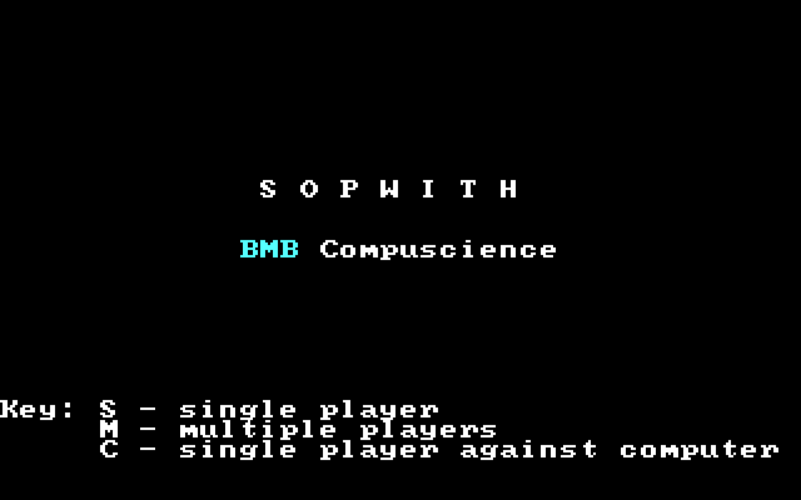
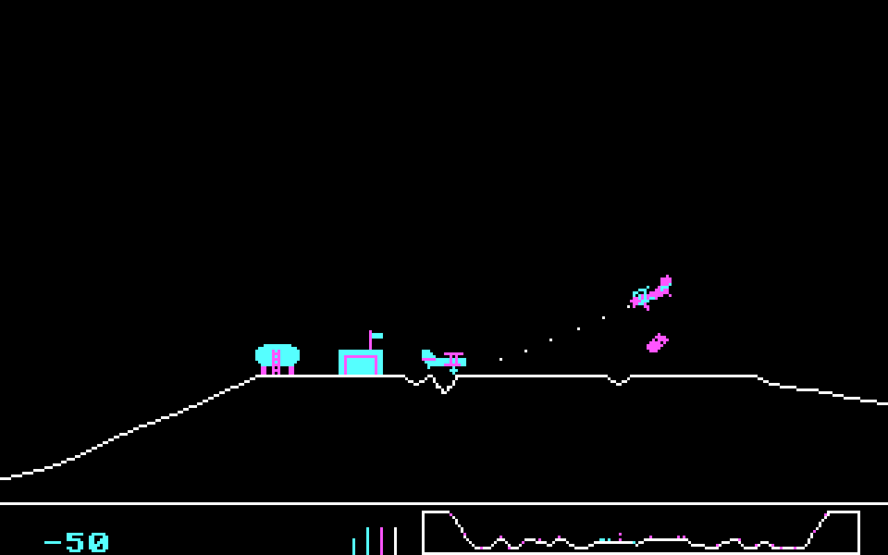
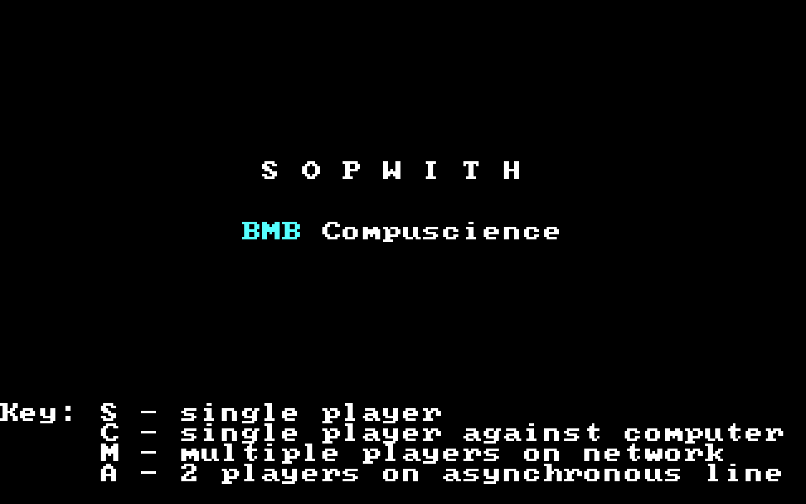
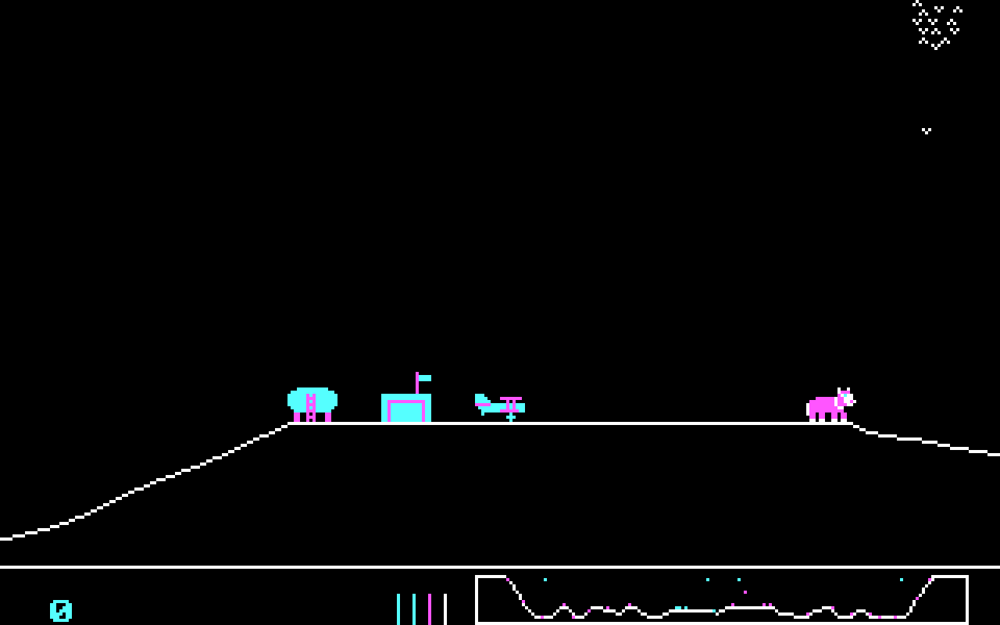
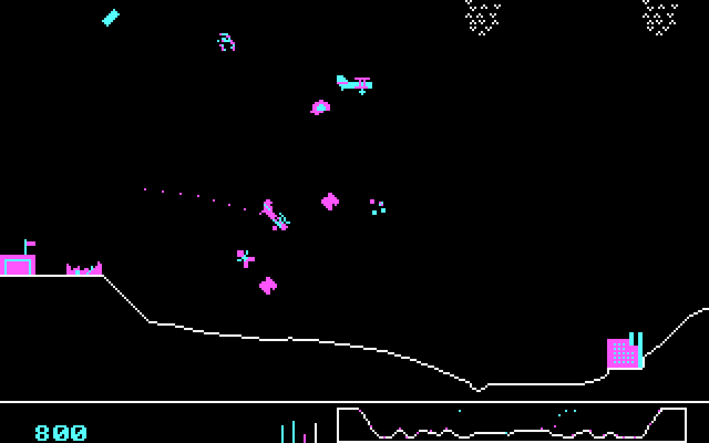
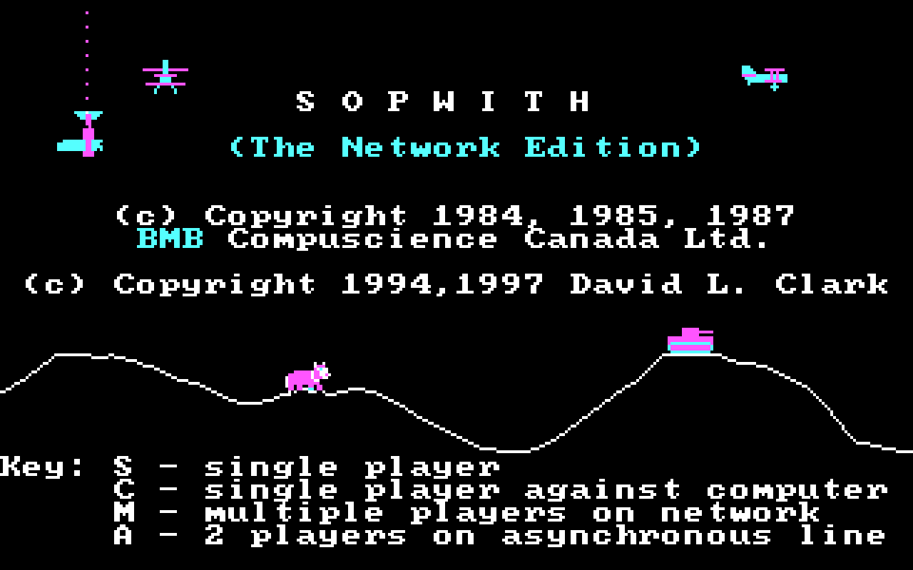
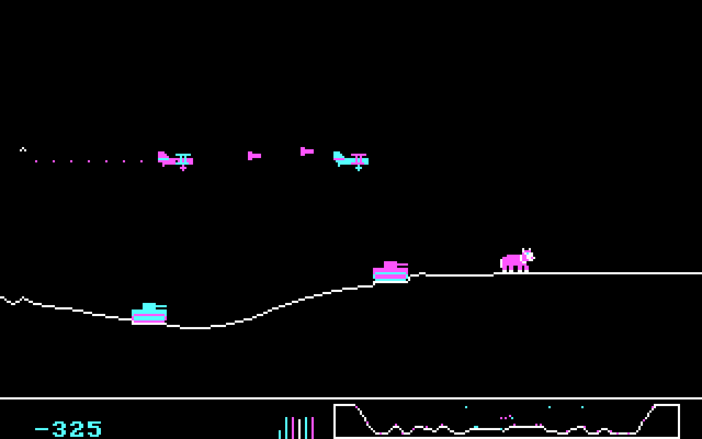
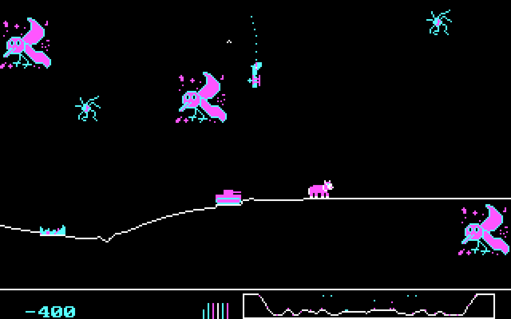
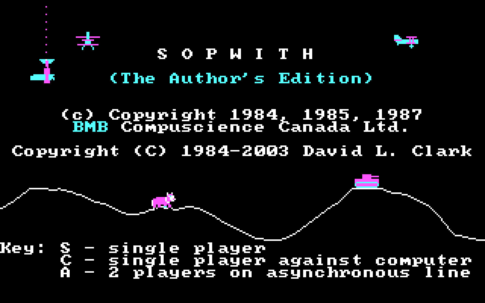

# Original DOS Sopwith versions

This page is intended to document the original DOS versions of Sopwith.
It's not really related to SDL Sopwith except as a historical
document for posterity and for people who are interested in such things.
Please note that other than the Network Edition, these versions are
**not** open source.

## Features

|     | 1   | 1.5 | 2   | Network Edition | Author's Edition |
| --- | --- | --- | --- | --------------- | ---------------- | 
| Solid ground                    | X |   |   |   |   |
| Speed depends on CPU            | X | X |   |   |   |
| Enemy planes drop bombs         |   | X |   |   |   |
| Oxen and birds                  |   |   | X | X | X |
| Explosions leave debris         |   |   | X | X | X |
| Novice mode                     |   |   |   | X | X |
| Missiles and starbursts         |   |   |   | X | X |
| Wounded planes                  |   |   |   | X | X |
| Window "splats"                 |   |   |   | X | X |
| Imaginet multiplayer            | X | X | X | X |   |
| Async (serial line) multiplayer |   |   | X | X | X |
| Joystick support                |   | X | X | X | X |
| Compiler                        | Computer Innovations C | CIC | CIC | Microsoft C | MSC |

## Sopwith 1

The oldest version, released in 1984, was the original demo for
the Imaginet networking system developed by BMB Compuscience of Canada.
Its main distinguishing feature is the use of solid white ground, which
was later replaced by a single line (to improve performance). To
avoid having to redraw the screen, the "camera" only moves sometimes.

Speed is CPU-dependent, so the game runs too fast on machines faster
than the original IBM XT unless a utility like MOSLO is used (or the
number of cycles adjusted to a low number on emulators like DOSbox.

The musical theme to this version is 
[Merrily We Roll Along](https://en.wikipedia.org/wiki/Merrily_We_Roll_Along_\(song\)),
better known as the theme song for the Warner Brothers ***Merry Melodies***
cartoon. However, the music doesn't play on the title screen unless Sopwith
is run with the `-s` command line parameter.

Multiplayer depends on the proprietary BMB drivers and Imaginet networking
system and to my knowledge, no fans have ever been able to get it working.

  

## Sopwith 1.5

I recently came across this version, which I'm calling Sopwith 1.5 since
its development clearly sits between the better known Sopwith 1 and 2. In
my opinion this is perhaps best described as a beta version of the later
Sopwith 2 - it is unique in that planes drop bombs, a feature that never
appeared in later versions and appears to be broken.

Solid ground has been replaced by a line at this point in development,
and joystick supported.
However, later changes are not yet present, like oxen and birds,
or explosions leaving debris. It still runs at the speed of the CPU,
like Sopwith 1, so the same slowdown techniques are needed to make it
playable.

By this version the theme music has been changed to [The U.S. Air Force](https://en.wikipedia.org/wiki/The_U.S._Air_Force_\(song\))
(aka ***Wild Blue Yonder***), the official song of the US Air Force.
This music is used in Sopwith 2 and all future versions.

 
     
## Sopwith 2

Perhaps the best-known of the DOS versions, this was a significant step
forward over the original. Note that the name "Sopwith 2" is a fan
invention to distinguish it from the older version, and the game does
not describe it with that name.

In terms of gameplay the most immediately noticeable feature is the
addition of oxen and birds to the game. More subtle changes include tweaks
to how explosions work - debris is longer-lived and provides more of a
hazard to the player. Speed is now CPU independent, the game supports
IBM compatible joysticks, and serial line networking, although this
latter feature is still unusable because it also requires a proprietary
BMB driver.

  

## Network Edition

Released by the author David L. Clark in the late '90s, the main features
are the addition of novice mode and wounded planes. Novice mode in
particular is convenient since it makes it impossible to stall the
plane, a common stumbling block for new players.

A controversial feature added in this release is guided missiles and
starbursts (chaff/flares) which are presumably intended to make multiplayer
more fun (they have to be enabled with the `-x` command line parameter).
The missiles are dumb missiles when fired by the player but heat-seeking
when fired by computer planes, making the single player experience almost
impossible.

Some more subtle changes: oil tank explosions were made much smaller,
bird strikes no longer result in an explosion, and computer planes avoid
crashing into oxen.

A cute addition is that of window "splats": bird strikes result in a
splatted bird appearing on the screen, and getting hit by a bullet results
in similar broken glass cracks. Perhaps the funniest of all occurs after
flying through an ox: the entire screen turns pink from blood.

There is also a new title screen. This version was the base for the later
source code release by Clark.

  

## Author's Edition

Largely identical to the Network Edition, but the original BMB networking
has been removed.

