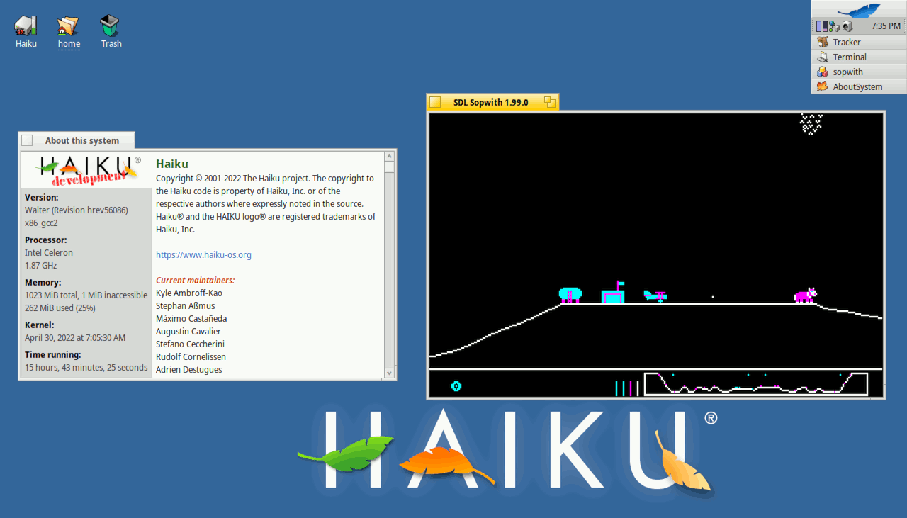

SDL Sopwith running under Windows 7 (screenshot credit: Alaux)

SDL Sopwith running under Linux with the XFCE desktop.

SDL Sopwith running under macOS.

SDL Sopwith's use of the SDL library means that it will even run on more
niche OSes such as [Haiku](https://www.haiku-os.org/).

Looks can sometimes be deceptive. This is actually SDL Sopwith running under
NetBSD on a Raspberry Pi. In the screenshot you can see a splatted bird that
has wounded the plane, two optional features that can be turned on.

Multiplayer mode allows you to dogfight with your friends.

